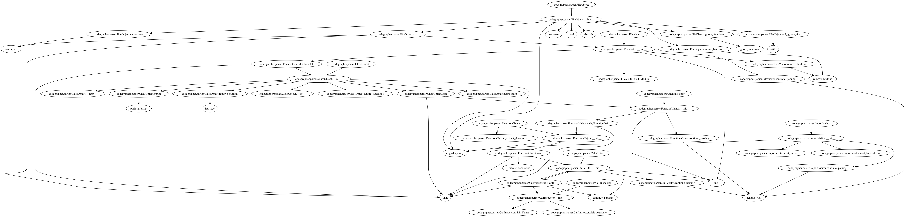

codegrapher
===========

.. image:: https://travis-ci.org/LaurEars/codegrapher.svg?branch=master
    :target: https://travis-ci.org/LaurEars/codegrapher

Code that graphs code
---------------------
Uses the python `AST <https://docs.python.org/2/library/ast.html>`_ to parse Python source code and build a call graph.

Output
------
An example of the current output of the parser parsing itself.

Installation
------------

.. code:: bash

    pip install codegrapher

To generate graphs, `graphviz <http://www.graphviz.org/Download.php>`_ must be installed.

Usage
-----

At the command line
~~~~~~~~~~~~~~~~~~~
To parse a file and output results to the console:

.. code:: bash

    codegrapher path/to/file.py --printed

To parse a file and output results to a file:

.. code:: bash

    codegrapher path/to/file.py --output output_file_name --output-type png

To analyze a directory of files, along with all files it contains:

.. code:: bash

    codegrapher -r path/to/directory --output multiple_file_analysis

And if you have a list of functions that aren't useful in your graph, add it to a `.cg_ignore` file:

::

    # cg_ignore file
    # all lines beginning with '#' are ignored

    # every function calls this, so it's not helpful in my graph:
    log_error

    # I don't want to see this in my graph:
    parse
    lower

Then add the `--ignore` flag to your command. Using the flag `--remove-builtins` provides the same functionality
for ignoring items found in `__builtins__`.

As a Python module
~~~~~~~~~~~~~~~~~~

To easily parse code in Python :

.. code:: python

    from codegrapher.parser import FileObject

    file_object = FileObject('path/to/file.py')
    file_object.visit()

And then to add that code to a graph and render it (using graphviz):

.. code:: python

    from codegrapher.graph import FunctionGrapher

    graph = FunctionGrapher()
    graph.add_file_to_graph(file_object)
    graph.name = 'name.gv'
    graph.format = 'png'
    graph.render()

Which will produce your code as a png file, `name.gv.png`, along with a
`dot file <http://en.wikipedia.org/wiki/DOT_%28graph_description_language%29>`_ `name.gv`

More documentation for the Python module can be found at
`Read the Docs <http://codegrapher.readthedocs.org/en/latest/>`_.
